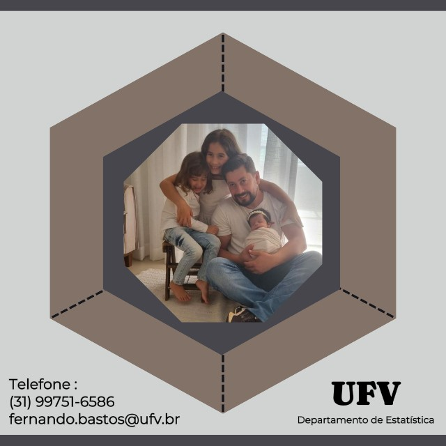
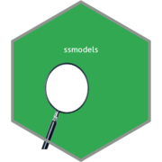
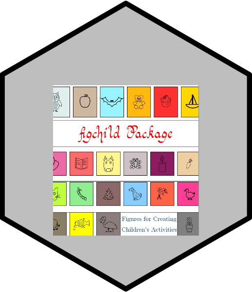
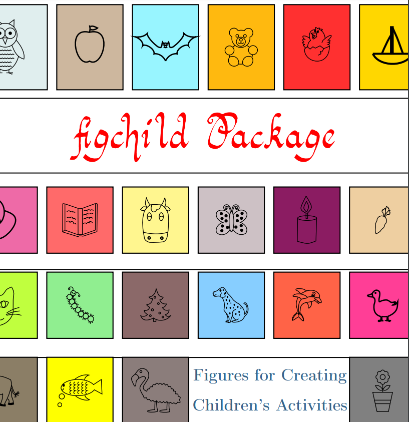

```{r setup, include=FALSE}
options(htmltools.dir.version = FALSE)
knitr::opts_chunk$set(
  fig.width=9, fig.height=3.5, fig.retina=3,
  out.width = "100%",
  cache = FALSE,
  echo = TRUE,
  message = FALSE, 
  warning = FALSE,
  hiline = TRUE,
  fig.align = "center"
)
```

```{r eval=FALSE, include=FALSE}
# devtools::install_github("hadley/emo")
# devtools::install_github("gadenbuie/xaringanExtra")
# devtools::install_github("gadenbuie/ermoji")
```


```{r xaringanExtra-clipboard, echo=FALSE}
xaringanExtra::use_clipboard()
```


```{r xaringan-themer, include=FALSE, warning=FALSE}
library(xaringanthemer)
style_duo_accent(
  primary_color = "#138583",
  title_slide_background_color = "#51B8B6",
  title_slide_text_color = "#FFFFFF",
  inverse_text_color = "#138583",
  inverse_header_color = "#138583",
  secondary_color = "#EDBBC8",
  
  header_font_google = google_font("Josefin Slab", "600"),
  text_font_google   = google_font("Work Sans", "300", "300i"),
  code_font_google   = google_font("Fira Code"),
  base_font_size = "25px"
)
```


.pull-left[

## Fernando de Souza Bastos

- Doutor em Estatística - UFMG 2018

- 2010 à 2022- Professor do Curso de Matemática - Licenciatura (Campus UFV - Florestal)

- Desde 2022 - Professor do Departamento de Estatística (Campus UFV - Viçosa) 

- Pai da Ana Beatriz, da Ana Laura e da Ana Júlia
]

.pull-right[
<center>

</center>

]

---

### R: Comunidades, pacotes, produtos..
<center>

<a href='https://cran.case.edu/web/packages/heckmanGE/index.html'>  </a>


<a href='https://cran.r-project.org/web/packages/ssmodels/index.html'>  </a>

<a href='https://ctan.org/pkg/figchild'>  </a>


<!--
<a href='https://github.io/fsbmat-ufv/'>  </a>
<a href='https://saopaulo2019.satrdays.org/'>  </a>
<a href='https://latin-r.com/'>  </a>
<a href='https://carpentries.org/'>   </a>
<a href='https://user2021.r-project.org/'>   </a>

<a href='https://cienciadedatos.github.io/dados/'>  </a> 
<a href='https://beatrizmilz.github.io/mananciais/'>  </a>
</center>

-->
---

## Proposta do Projeto


O projeto ``Pesquisa e Criação de Ferramentas Práticas para o Ensino de Estatística'', 
aprovado no Edital de Bolsas de Iniciação Científica da UFV de 2023, com apoio do CNPq, 
teve como objetivo desenvolver ferramentas práticas para o ensino de Estatística básica 
em cursos de graduação, utilizando o _software R_ e pacotes como _tidyverse_, 
_shinydashboard_, _ggplot_ e _learnR_, entre outras ferramentas tecnológicas.


---


## Desenvolvimento


 - Inicialmente, foi realizado uma discussão entre a bolsista do projeto e o orientador 
 e também professor da disciplina de Estatística I (EST 106), ofertada para alunos dos 
 cursos de Ciências Exatas da UFV, sobre requisitos e necessidades específicas dos 
 estudantes e professores na área de Estatística básica.
 
 - Pesquisamos, sites de professores no Brasil e no mundo de diversas instituições 
 e elaboramos uma lista com roteiros de aulas, apostilas, livros utilizados na 
 graduação, \textit{applets}, aplicativos e ferramentas práticas para identificar 
 materiais estatísticos relevantes e as possibilidades de uso, transformação de 
 materiais ou criação de novas ferramentas para o ensino.
 
 - Identificamos muito material interessante, _applets_, _softwares_, listas de 
 exercícios e muitas ideias...
 
---

## Começo do Trabalho

 - Entendemos que aprender conceitos de tabelas e gráficos de forma visual e prática é
 essencial no curso de Estatística, pois permite ao estudante compreender o processo 
 completo de análise de dados, desde sua coleta até a apresentação dos resultados. A 
 experiência prática com dados brutos oferece uma visão realista dos desafios que envolvem 
 a limpeza e organização das informações, etapas fundamentais para garantir a qualidade e 
 confiabilidade das análises. Antes de construir gráficos, é extremamente importante que o 
 estudante pelo menos visualize a dificuldade de lidar com dados desorganizados, errados ou 
 incompletos, aplicando técnicas de tratamento e validação. 
 
 - Assim, criamos um questionário para coleta de dados no google forms. Tal questionário é 
 preenchido pelos estudantes nas primeiras aulas, após iniciarem o conteúdo de tabelas de 
 frequência e gráficos. Vejam [aqui](https://forms.gle/ZomkKuRJBzGUgKTE7) o questionário!

---

### Visualização e Limpeza dos Dados

Após observar as respostas ao questionário apresento aos estudantes alguns erros 
no preenchimento do mesmo. Cito aqui por exemplo, a resposta qualitativa em locais 
que esperamos resposta numérica, respostas iguais que são escritas de maneiras 
distintas, por exemplo, ao responder sua cidade de residência alguns estudantes 
colocam Belo Horizonte, Belo-Horizonte, Belo - Horizonte, Belo- Horizonte, Belo 
-Horizonte, BH, BH-MG, BH nas Férias e em Viçosa no Período de aula e assim, por 
diante!

Criamos então um código em linguagem R que faz a leitura dos dados, transforma tudo 
em caiixa alta, remove acentos e caracteres especiais, corrige alguns desses erros 
que já apareceram no banco de dados e apresenta as tabelas e gráficos corrigidos 
ou próximo do melhor resultado. É fato que semestralmente, mudanças precisam ser 
realizadas nos códigos! Vejam [aqui](https://rpubs.com/fsbmat/CensoEst105) alguns 
resultados do questionário aplicado nesse semestre!

---

### Discussões

As discussões que surgem durante a aula que apresentamos os resultados são 
extremamente interessantes, a construção de tabelas e gráficos claros e interpretáveis 
cria um elo entre os alunos e o professor, a aula torna-se mais interessante e mais 
descontraida, pois há respostas que geram questionamentos e etc. É claro que em uma 
primeira aula, os alunos conseguem se identificar ou identificar algum colega, por isso, 
o professor deve ter um senso critico antes de apresentar os resultados, mas ao longo 
dos semestres, juntando as respostas de todas as turmas, fica dificil identificar 
um estudante especifico, não criando assim, nenhum problema com o seu uso. 

Alguma variáveis que apresentam respostas interessantes:

- Idade
- Você Acredita que Terá um Bom Resultado na Disciplina de EST?
- Qual o Salário que Você Acredita que Será Ofertado Para Você No Início de Sua Carreira
Profissional (Após Formado)? 
- Você Tem Costume de Estudar Antecipadamente Para as Provas ou Somente na Véspera? 
- Entre outras

---

## Greve

No decorrer do projeto houve a greve dos professores, que durou cerca de três meses, 
por isso, alteramos nossa proposta inicial de desenvolver aplicativos e iniciamos a criação 
da apostila interativa do curso de Estatística I (EST 106), a mesma ainda encontra-se 
em desenvolvimento, mas com a totalidade dos assuntos da disciplina escrita e disponível. 
A mesma foi baseada na apostila de EST 106 da UFV escrita pelo professor Luiz Alexandre 
Peternelli com pequenas alterações. 
[Clique aqui](https://pibicest.shinyapps.io/ApostilaInterativa/) para visualiza-la!

---

## Temas a partir de agora...

- O que é o pacote learnr

- Como usar e criar os tutoriais feitos com learnr?

- Links para saber mais, e referências

---
class: middle

## Pacote learnr 📦

- É extremamente interessante para quem deseja aprender 👩‍🎓 ou para quem deseja ensinar! 👩‍🏫

- [Documentação](https://rstudio.github.io/learnr/) do pacote e repositório no 
[GitHub](https://github.com/rstudio/learnr)

- Mantido pela [RStudio](https://www.rstudio.com/), que é muito além de uma IDE!

- Começou a ser desenvolvido em outubro de 2016, pelo [
J.J. Allaire](https://github.com/jjallaire) - fundador e CEO da RStudio

- Pessoas mais ativas na manutenção e desenvolvimento do pacote: 
[Barret Schloerke](https://github.com/schloerke) e 
[Garrick Aden-Buie](https://github.com/gadenbuie) 


---

## Pacote learnr 📦


- Escrevemos um arquivo _.Rmd_ e geramos um aplicativo Shiny.

- Podemos adicionar os conteúdos que já são possíveis de serem adicionados em um 
_.Rmd_, como: textos, imagens, vídeos, equações, códigos, tabelas, etc. 

- Além disso, também podemos colocar: 
  - Exercícios (exercises)
  - Perguntas de múltipla escola (questions)


---

## Mãos à Obra!

- Crie uma conta no 
[Rstudio Cloud](https://login.posit.cloud/register?redirect=https%3A%2F%2Fclient.login.posit.cloud%2Foauth%2Flogin%3Fshow_auth%3D0%26show_login%3D0), você terá que verificar 
seu e-mail.
- Escolha **Posit Cloud** na tela inicial, depois, clique em _New Project_, em seguida em 
_New RStudio Project_
- Após abrir o _RStudio_, crie um arquivo .R e vamos instalar alguns pacotes com o comando:
 - install.packages(c("tidyverse", "knitr", "learnr"), dependencies = TRUE)

Clique em _File_ -> _New File_ -> _R Markdown_ -> _From Template_ 
-> _Interactive Tutorial_ -> _OK_


---


---

## Alteração do yaml e criação de exercícios

Vou mostrar como criar o seguinte tutorial: 
[Clique Aqui!](https://pibicest.shinyapps.io/Tutorial/)

---

## Disponibilizar Online

Clique em Publish e Instale os pacotes solicitados. Escolha posteriormente conectar em uma 
conta e escolha ShinyApps.io (Você terá que entrar em sua conta que já está criada) e 
copiar o token da conta, posteriormente clique em ShinyApps.io e acrescente seu token, clique em conectar e publicar!

